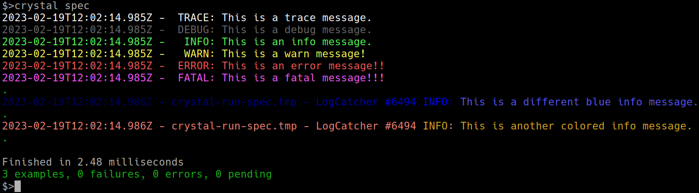

# collog - colorized logging



collog is a library for colored logging output.
The default usage colorizes the available log levels in different colors.
But it is also possible to customize all log levels and all format fields.
This is done by monkey-patching the standard log library. 
For further examples have a look at the specs.

[](https://github.com/4ndyfix/collog/actions/workflows/crystal.yml)

## Installation

1. Add the dependency to your `shard.yml`:

   ```yaml
   dependencies:
     collog:
       github: 4ndyfix/collog
   ```

2. Run `shards install`

## Usage

```crystal
require "collog"

class SimpleLogExample
  Log = ::Log.for self.name

  def initialize
    ::Log.colorized = true
    ::Log.setup :trace
  end

  def run
    Log.trace { "This is a trace message." }
    Log.debug { "This is a debug message." }
    Log.info { "This is an info message." }
    Log.warn { "This is a warn message!" }
    Log.error { "This is an error message!!" }
    raise "raised!"
  rescue exc
    Log.fatal(exception: exc) { "This is a fatal message!!!" }
  end
end

SimpleLogExample.new.run
```

## Contributing

1. Fork it (<https://github.com/your-github-user/collog/fork>)
2. Create your feature branch (`git checkout -b my-new-feature`)
3. Commit your changes (`git commit -am 'Add some feature'`)
4. Push to the branch (`git push origin my-new-feature`)
5. Create a new Pull Request

## Contributors

- [4ndyfix](https://github.com/4ndyfix) - creator and maintainer
